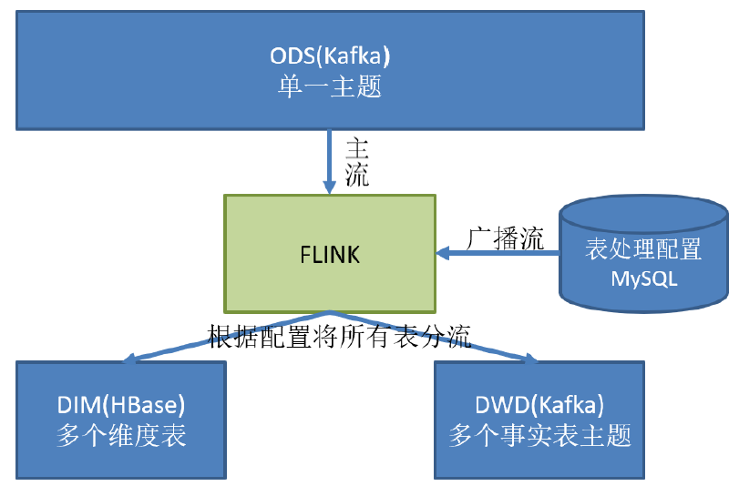
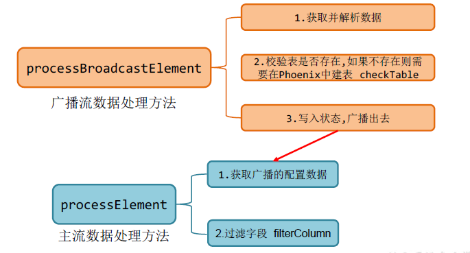
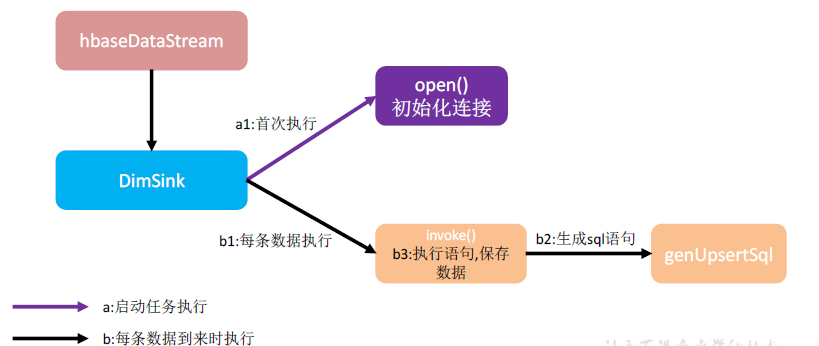

### 1.日志数据数据
#### 1.1 从ods到dwd

```
# 手动测试输入

kafka-console-producer.sh --broker-list hadoop101:9092 --topic ods_base_log

# 查看ods的行为日志
kafka-console-consumer.sh --bootstrap-server hadoop102:9092 --topic ods_base_log
# 分流后的dwd行为数据
kafka-console-consumer.sh --bootstrap-server hadoop102:9092 --topic dwd_start_log
kafka-console-consumer.sh --bootstrap-server hadoop102:9092 --topic dwd_page_log
kafka-console-consumer.sh --bootstrap-server hadoop102:9092 --topic dwd_display_log

```


### 2. 业务数据
#### 业务数据DWD层

需要实现**动态分流**的功能

在实时计算中一般把维度数据写入存储容器，一般是方便通过主键查询的数据库比如HBase,Redis,MySQL等。一般把事实数据写入流中，进行进一步处理，最终形成宽表

配置不适合写在配置文件中，需要一种动态配置方案，能够长期保存，让实时计算能够自动感知。有以下几种实现方式：
- 方式1：使用zk存储，通过watch感知数据变化
- 方式2：用mysql数据库存储，周期性同步
- 方式3：用mysql数据库存储，使用广播流

这里选择方式3



配置表：table_process
```
use gmall-config;
CREATE TABLE `table_process` ( 
    `source_table` varchar(200) NOT NULL COMMENT '来源表', 
    `operate_type` varchar(200) NOT NULL COMMENT '操作类型 insert,update,delete', 
    `sink_type` varchar(200) DEFAULT NULL COMMENT '输出类型 hbase kafka', 
    `sink_table` varchar(200) DEFAULT NULL COMMENT '输出表 (主题 )', 
    `sink_columns` varchar(2000) DEFAULT NULL COMMENT '输出字段', 
    `sink_pk` varchar(200) DEFAULT NULL COMMENT '主键字段', 
    `sink_extend` varchar(200) DEFAULT NULL COMMENT '建表扩展', 
PRIMARY KEY (`source_table`,`operate_type`) 
) ENGINE=InnoDB DEFAULT CHARSET=utf8;

-- 注意，这里的主键是 source_table和operate_type
-- 因此做成广播流的时候，广播流的key就是 source_table + "_" +  operate_type 
```

广播流和主流需要做的事情：




##### 分流sink 
1、维度数据写入HBase(Phoenix)




在Phoenix上创建 `GMALL_REALTIME` 这个schema
```
create schema GMALL_REALTIME;
```