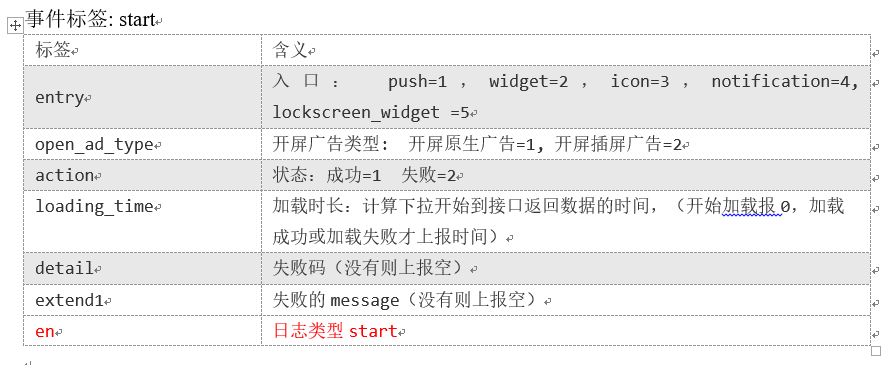

## 01数据生成模块

### 1.埋点数据
埋点数据基本格式：
- 公共字段：基本所有安卓手机都包含的字段
- 业务字段：埋点上报的字段，有具体的业务类型

示例：
```
{
"ap":"xxxxx",//项目数据来源 app pc
"cm": {  //公共字段
		"mid": "",  // (String) 设备唯一标识
        "uid": "",  // (String) 用户标识
        "vc": "1",  // (String) versionCode，程序版本号
        "vn": "1.0",  // (String) versionName，程序版本名
        "l": "zh",  // (String) language系统语言
        "sr": "",  // (String) 渠道号，应用从哪个渠道来的。
        "os": "7.1.1",  // (String) Android系统版本
        "ar": "CN",  // (String) area区域
        "md": "BBB100-1",  // (String) model手机型号
        "ba": "blackberry",  // (String) brand手机品牌
        "sv": "V2.2.1",  // (String) sdkVersion
        "g": "",  // (String) gmail
        "hw": "1620x1080",  // (String) heightXwidth，屏幕宽高
        "t": "1506047606608",  // (String) 客户端日志产生时的时间
        "nw": "WIFI",  // (String) 网络模式
        "ln": 0,  // (double) lng经度
        "la": 0  // (double) lat 纬度
    },
"et":  [  //事件
            {
                "ett": "1506047605364",  //客户端事件产生时间
                "en": "display",  //事件名称
                "kv": {  //事件结果，以key-value形式自行定义
                    "goodsid": "236",
                    "action": "1",
                    "extend1": "1",
                    "place": "2",
                    "category": "75"
                }
            }
        ]
}

```

日志的存储格式： 服务器接收时间戳|事件json

### 2.事件日志数据
- 商品列表页(loading)
- 商品点击(display)
- 商品详情页(newsdetail)
- 消息通知(notification)
- 广告(ad)
- 用户后台活跃(active_background)
- 评论（comment）
- 收藏（favorites）
- 点赞（praise）
- 错误日志

具体字段结构参见： [images(321-330)](images/)

### 3.启动日志数据



### 4. 