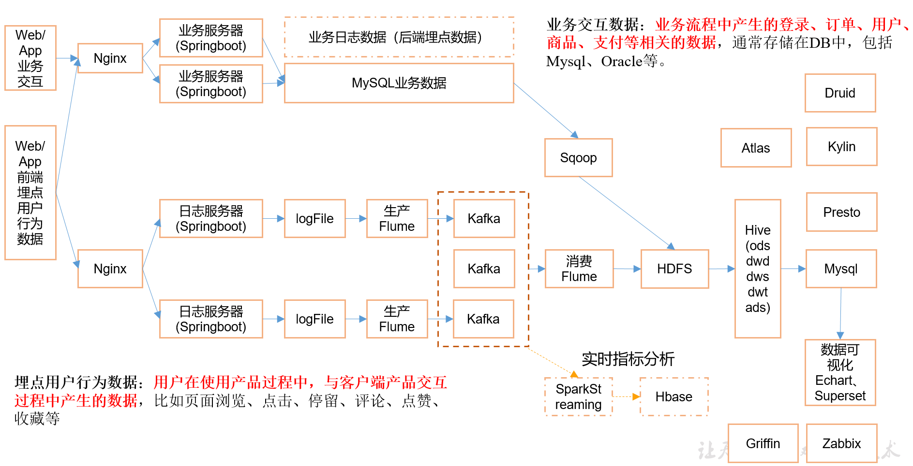

## 电商数仓项目

项目整体流程设计

【一个数仓架构师需要思考的问题】
- 项目技术如何选型?
    - 数据传输：**Flume、Kafka、Sqoop**、Logstash、DataX
    - 数据存储：**mysql、HDFS**、HBase、Redis、Mongodb
    - 数据计算：**Hive、Tez、Spark**、Flink、Storm
    - 数据查询（即席查询）：**Presto、Druid**、Impala、Kylin
    - 数据可视化： echarts、Superset、QuickBI、DataV 
    - 任务调度：airflow、oozie、azkaban
    - 元数据管理：Atlas
    - 数据质量监控：Griffin
    
> 主要考虑的因素：数据量大小、业务需求、行业内经验、技术成熟度、开发维护成本、总成本预算

- 框架版本如何选型?
- 服务器使用物理机还是云主机
    - 机器成本考虑
        - 物理机： 128G内存、20核物理CPU、40线程、8THDD和2TSSD硬盘，一般物理机寿命5年左右，需考虑托管服务。戴尔单台报价4w出头
        - 云主机：阿里云为例，相同配置每年5w
    - 运维成本考虑
        - 物理机：需要有专业运维人员
        - 云主机：运维相对轻松
- 如何确认集群规模?
    - 如何确定集群规模
        - 每天日活100万，每人一天平均100条：10万*100条=1亿条
        - 每天日志1k左右，每天一亿：1亿/1024/1024=约100G
        - 要求半年内不扩容服务器：100G*180天=约18T
        - 保存3副本： 18*3=54T
        - 预留20%-30%buf： 54T/0.7=77T
        - 所以：约 8T*10 台服务器
    - 如何考虑数仓分层？
        - 服务器将近再扩容1-2倍

【选型】

框架 | Apache版本 | CDH版本（5.12.1）
--- | --- | ---
Hadoop | 2.7.2 | 2.6.0
spark | | 1.7.0 （实际用2.0以上）
Flume | 1.7.0 | 1.6.0 
Kafka | 0.11.02 | 
Kafka Manager | 1.3.3.22 | 
Hive | 2.3 | 1.1.0 
Sqoop | 1.4.6 | 1.4.6
Azkaban | 2.5.0 | 
Oozie |  | 4.1.0
Zookeeper | 3.4.10 | 
Presto | 0.189
Impala | | 2.9.0

项目组成结构：
- 01数据生成模块