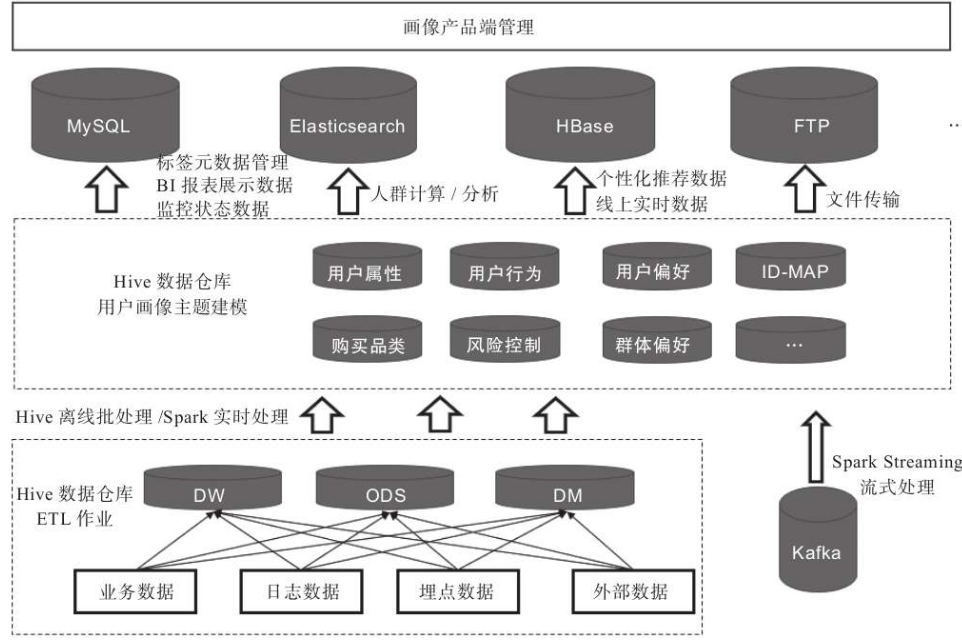
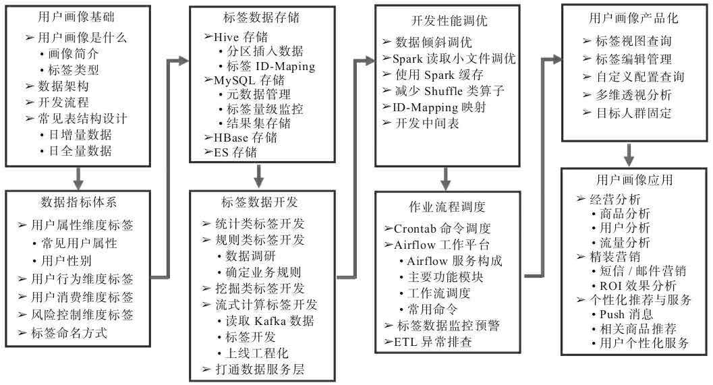
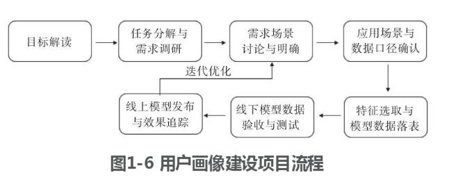
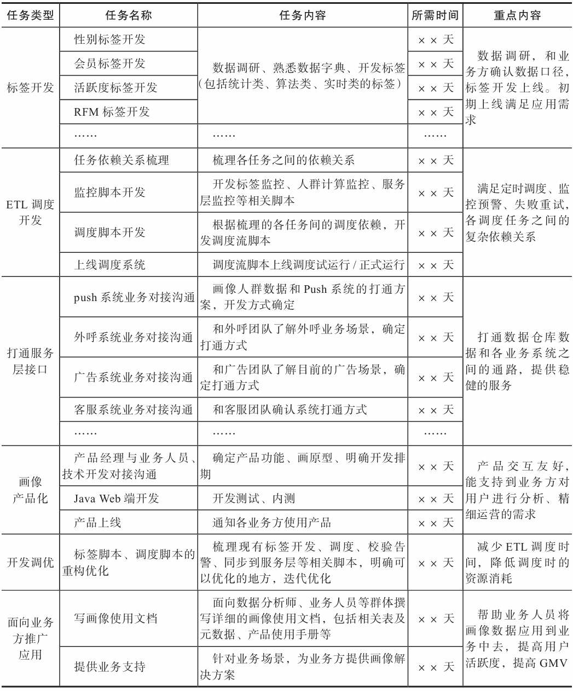
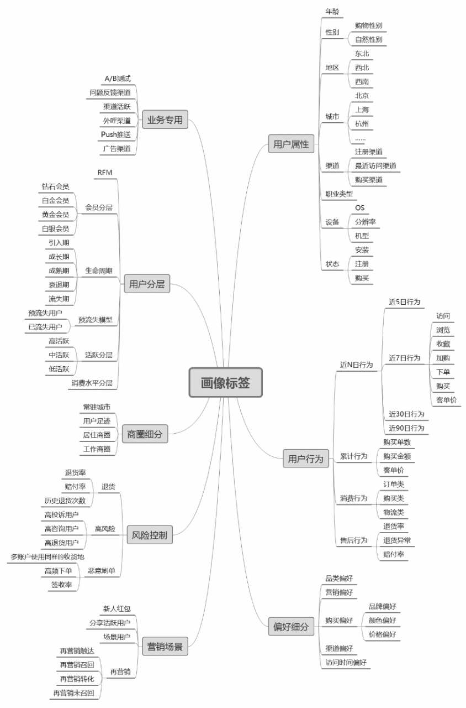
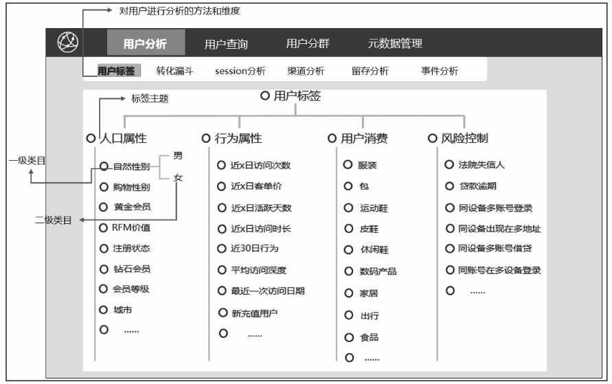
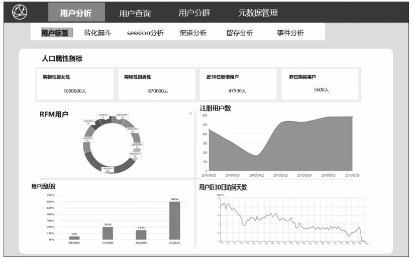
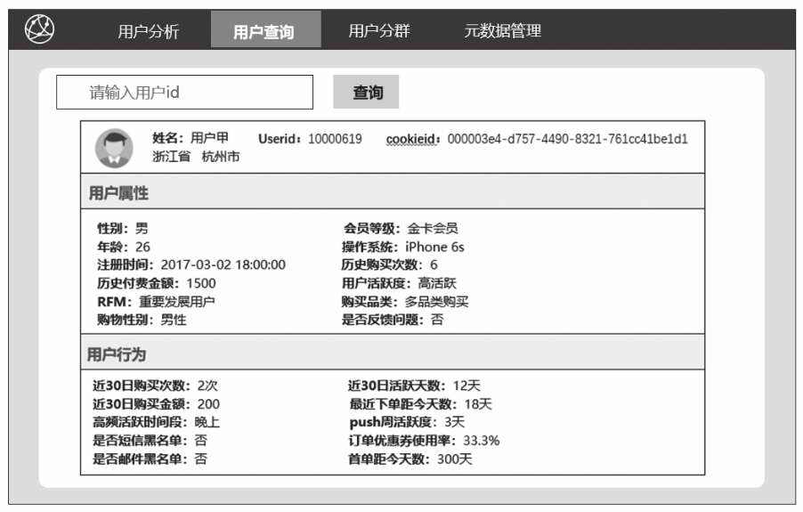

## 用户画像系统
> 参考书籍：《用户画像：方法论与工程化解决方案》 https://github.com/HunterChao/User-Portrait

用户画像建模就是对用户“打标签”，有三种类型；
- 统计类：性别、年龄、近7天活跃时长、活跃天数等
- 规则类：比如“消费活跃”用户的口径定义为“近30天交易次数>2”（运营人员和数据人员共同协商确定）
- 机器学习数据挖掘类：比如购买商品偏好、用户流失意向等（成本高，一般这类标签占比较少）



用户画像模块建设








### 案例：图书电商
商城的运营目标：
- 兼顾自身商业目标的同时更好的满足消费者的需求，通过推荐系统提高点击率等
- 建立用户流失预警机制，及时级别将要流失的用户群体，采用运营策略挽回用户

表：
- 用户信息表 dim.user_basic_info
- 商品订单表 dw.order_info_fact 
- 埋点日志表 ods.page_event_log
- 访问日志表 ods.page_view_log
- 商品评价表 dw.book_comment
- 搜索日志表 dw.app_search_log
- 用户收藏表 dw.book_collection_df
- 购物车信息表 dw.shopping_cart_df


用户画像表结构设计
- 全量数据表：每个日期分区都存储当天全量数据
- 增量数据表：每个日期分区存储当天被打上标签的用户
- 宽表设计：
    - 用户属性宽表
    - 用户日活跃宽表

### 数据标签体系（关键环节）：
1.划分方式：
- 按五种维度划分
    - 用户属性维度
        - 年龄、性别、安装时间、注册状态、城市
        - 活跃登录地、历史购买状态、历史购买金额
    - 用户行为维度
        - 订单相关行为、访问行为
        - 近30天行为类型指标（比如活跃多少天）、高频率活跃时间段、点击偏好、营销敏感度等
    - 用户消费维度
        - 浏览品类
        - 近7天加购类
        - 近7天收藏类
        - 近7天购买类
    - 风险控制维度
        - 账号风险
        - 设备风险
        - 借贷风险
    - 社交属性维度 
        - 常登录地、上午、中午、下午
        - 单身、有小孩、市场销售、公务员
- 按应用场景划分



2.标签命名方式
- 规范： 标签主题_用户维度_标签类型_一级归类
- 标签主题
    - 人口属性 ATTRITUBE
    - 行为属性 ACTION
    - 用户消费 CONSUME
    - 风险控制 RISKMANAGE
- 用户维度：标签打在用户user_id上还是设备cookieid上（可用U、C等字母标识）
- 标签类型：统计类、规则类、算法类
- 一级标签：可以再不断的细化下去
```
比如：
标签男： ATTRITUBE_U_01_001
标签女： ATTRITUBE_U_01_002

01表示一级分类
001和002是该一级标签下的标签明细
```

### 用户画像产品化
- 即席查询
- 标签视图与标签查询







